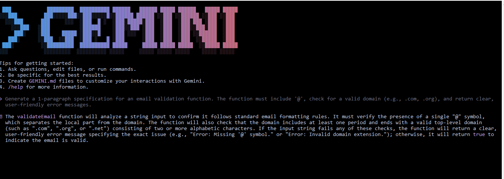

# Task 02 — AI-Driven Development
# 30-Day AI-Driven Development Challenge — Day 3 + 4

## 📝 Part A — Theory

### 1️⃣ Nine Pillars & AI Development Agents
The Nine Pillars help a developer move beyond just writing code. They guide the developer in *planning, specifications, testing, automation, using AI agents, and deployment. This combination allows a developer to grow into an **M-Shaped Developer*, capable of handling multiple deep domains simultaneously and managing complex systems efficiently.

### 2️⃣ Vibe Coding vs Specification-Driven Development

*a) Why Vibe Coding causes problems after one week:*  
Vibe Coding creates issues because there is *no proper planning or specifications. Developers write code based on intuition or flow, so as the project grows, **structure and logic become unclear*, making error-solving and maintenance difficult.

*b) How Specification-Driven Development prevents problems:*  
Specification-Driven Development (SDD) solves this by *defining full specifications, architecture, and workflow before starting the project*. This ensures clarity, reduces bugs, and provides a clear roadmap, making future modifications and maintenance much easier.

### 3️⃣ Architecture Thinking

*a) How architecture-first thinking changes a developer's role:*  
Architecture-first thinking transforms the developer into a *system architect, responsible not just for coding but for **designing workflows, planning logic, and guiding AI agents. This makes development **predictable, scalable, and error-free*.

*b) Why developers must think in layers and systems:*  
Developers need to think in *Model → IDE → Agent layers* because each layer has a specific role: *Models handle intelligence, IDE is where development happens, and Agents execute workflows*. System-level thinking allows developers to manage complexity, reduce errors, and make AI-driven development efficient and scalable.

---

## 🧩 Part B — Practical Task (CLI Prompt + Output)

*CLI Prompt:*

Generate a 1-paragraph specification for an email validation function. The function must include '@', check for a valid domain (e.g., .com, .org), and return clear, user-friendly error messages.

*CLI Output:*

✦ The validateEmail function will analyze a string input to confirm it follows standard email formatting rules. It must verify the presence of a single "@" symbol,
  which separates the local part from the domain. The function will also check that the domain includes at least one period and ends with a valid top-level domain
  (such as ".com", ".org", or ".net") consisting of two or more alphabetic characters. If the input string fails any of these checks, the function will return a clear,
  user-friendly error message specifying the exact issue (e.g., "Error: Missing '@' symbol." or "Error: Invalid domain extension."); otherwise, it will return true to
  indicate the email is valid.

*Screenshot:*  

---

## 📚 Part C — Multiple Choice Questions

1. *What is the main purpose of Spec-Driven Development?*  
*Answer:* B — Clear requirements before coding begins

2. *What is the biggest mindset shift in AI-Driven Development?*  
*Answer:* B — Thinking in systems and clear instructions

3. *Biggest failure of Vibe Coding?*  
*Answer:* B — Architecture becomes hard to extend

4. *Main advantage of using AI CLI agents (like Gemini CLI)?*  
*Answer:* B — Handle repetitive tasks so dev focuses on design & problem-solving

5. *What defines an M-Shaped Developer?*  
*Answer:* C — Deep skills in multiple related domains

---

## ✅ Reflection

This task highlights how AI-driven development *redefines the role of developers*.  
Tools like *AI CLI agents, **Nine Pillars, and **Specification-Driven Development* allow developers to move from *code writers to system-level thinkers, eventually becoming **M-Shaped professionals* capable of handling complex systems efficiently.  

By practicing *architecture-first thinking* and collaborating with agents, developers can manage projects faster, reduce errors, and focus on *design, strategy, and problem-solving* rather than repetitive coding.