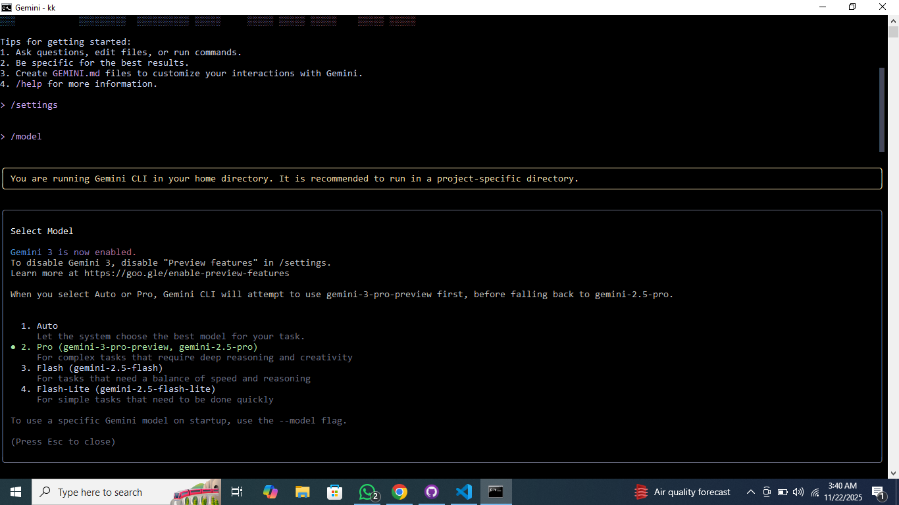

# Task 03 — AI-Driven Development
# 30-Day AI-Driven Development Challenge — Day 5 + 6

# 📌 Assignment: Gemini 3.0 — Research & Model Update

## 🌟 PART A — Research Questions

### 1️⃣ What new improvements were introduced in Gemini 3.0?

Gemini 3.0 mein reasoning, autonomy, aur tool usage mein significant upgrades hain.
Yeh tez, zyada accurate (sahi), aur complex agent workflows ke liye behtar capable hai.

---

### 2️⃣ How does Gemini 3.0 improve coding & automation workflows?

Gemini 3.0 behtar code generation, debugging, aur error handling ke saath end-to-end automation ko badhaata hai.
Improved CLI workflow support ke through repetitive setup work kam hota hai.

---

### 3️⃣ How does Gemini 3.0 improve multimodal understanding?

Model text, images, videos, aur documents ko high accuracy ke saath process karta hai.
Yeh robotics, document editing, aur complex multimodal reasoning tasks mein behtar perform karta hai.

---

### 4️⃣ Name any two developer tools introduced with Gemini 3.0.

1. Gemini CLI
2. Google Antigravity

---

## 🌟 PART B — Practical Task (Model Update)

### 🔧 Updated Gemini Model (Version 3.0)

*Command used:*

/model --select gemini-3.0

---

### 📸 Screenshot of Model Update

---

### 📝 Reflection

Maine CLI ka use karke Gemini model ko version 3.0 mein successfully update kiya.
Isse model selection aur developer workflows mein updates ki management samajhne mein madad mili.

---