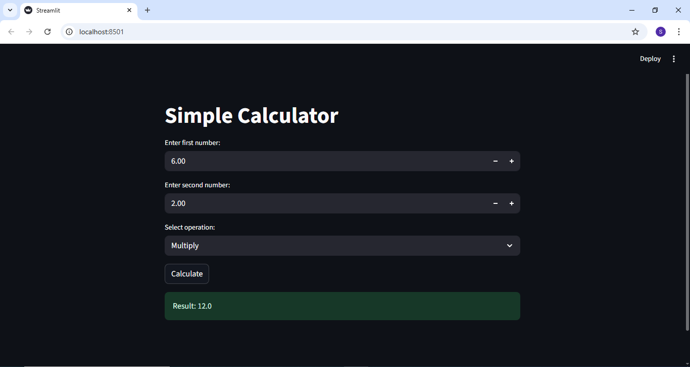
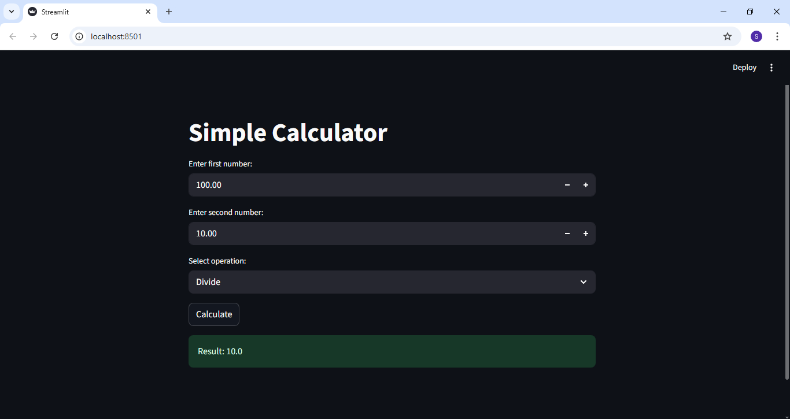

# ✅ Task 8 – Simple Calculator using SPECKit Plus (Claude)

## 🔷 What is this project?

Yeh ek *Simple CLI Calculator* hai jo maine Python language main banaya hai.
Is project ka maqsad yeh hai ke basic mathematical operations perform kiye ja saken:

- Addition (+)
- Subtraction (-)
- Multiplication (*)
- Division (/)

Yeh calculator *Cloud CLI / Terminal* main bana ha our ya web per run hota hai aur user se input le kar result show karta hai.

Is project ko maine *SPECKit Plus ke 5 phases* follow kar ke develop kiya hai.

---

## 🧩 Phase 1 – /constitution

Is phase main maine apne project ke rules aur standards define kiye:

- Calculator simple aur clean hona chahiye
- Code readable aur beginner-friendly hona chahiye
- User se 2 numbers aur 1 operator liya jayega
- Invalid input par error handle hoga
- Project CLI / terminal pe kaam karega
- Python best practices follow ki jayengi

Yeh rules is liye banaye gaye takay project organized aur professional rahe.

---

## 📝 Phase 2 – /specify

Is phase main maine project ke features aur working ko define kiya:

- User se first number input liya jata hai
- User se operator liya jata hai (+, -, *, /)
- User se second number input liya jata hai
- Program calculation perform karta hai
- Result terminal par show hota hai

Yeh calculator ek *simple aur fast tool* hai jo basic math problems solve karta hai.

---

## 📊 Phase 3 – /plan

Is phase main maine complete plan ready kiya:

1. Python ka use kiya jayega
2. CLI / Cloud Terminal main project run hoga
3. Ek simple function banaya jayega for calculation
4. User input handle karne ke liye input() function use hoga
5. Each operator ke liye separate condition hogi
6. Final result print kiya jayega

Is plan ko follow karke maine coding start ki.

---

## ✅ Phase 4 – /tasks

Is phase main maine project ko small tasks main divide kiya:

| Task | Description | Time |
|-----|------|------|
| Task 1 | User se first number lena | 5 min |
| Task 2 | Operator lena (+, -, *, /) | 5 min |
| Task 3 | Second number lena | 5 min |
| Task 4 | Calculation logic apply karna | 10 min |
| Task 5 | Result display karna | 5 min |

*Total Estimated Time: 30 minutes*

Is tarah project step by step complete kiya gaya.

---

## ⚙ Phase 5 – /implement

Is phase main maine poora project implement kiya:

- Python main code likha
- CLI par test kiya
- Different operations perform kar ke verify kiya
- Result accurate aaya

Calculator successfully kaam kar raha hai aur maine isko test bhi kar liya hai.

---

## 🖼 Calculator Test Screenshots

Maine 4 tests perform kiye aur unke screenshots attach kiye hain:

### ✅ Screenshot 1 – Addition
Example:  
*5 + 5 = 10*

---

### ✅ Screenshot 2 – Subtraction
Example:  
*10 - 3 = 7*

---

### ✅ Screenshot 3 – Multiplication
Example:  
*6 * 2 = 12*

---

### ✅ Screenshot 4 – Division
Example:  
*100 / 10 = 10*

---

## 🎯 Conclusion

SPECKit Plus ka use karke project ko clean aur structured tarike se banaya gaya.
Is method se:

- Planning easy ho jati hai
- Project organized hota hai
- Documentation automatically clear ban jati hai

Yeh approach real-world AI Driven Development main bohat useful hai.

---

✅ *Task 8 Completed Successfully*

## 🚀 Participant
*Muhammad Saad*  
AI Automation | AI Agents | Next.js Developer  
Focused on becoming a *top-level AI Developer*